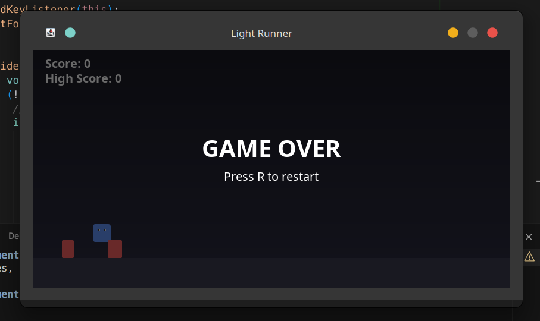

# 🎮 Light Runner

> A thrilling 2D platformer game built with Java Swing - Jump, survive, and beat your high score

<p align="center">

</p>

*The game in action - featuring smooth graphics, responsive controls, and an engaging gameplay experience!*

---

## ✨ Features

- 🚀 **Smooth jumping mechanics** with realistic gravity physics
- 🎯 **Obstacle avoidance gameplay** - jump over red obstacles to survive
- 📊 **Score tracking** and persistent high score system
- 🔄 **Game over screen** with instant restart functionality
- 🎨 **Modern UI** with gradient backgrounds and smooth graphics
- ⚡ **Responsive controls** with spacebar jumping
- 🎵 **Visual feedback** with character animations and smooth movement in it

## 🎯 Gameplay

Control a blue character and jump over obstacles to survive as long as possible! The game features:

- **Dynamic obstacles** that move from right to left
- **Physics-based jumping** with gravity effects
- **Score progression** - your score increases the longer you survive
- **High score tracking** - try to beat your personal best!
- **Smooth collision detection** for precise gameplay

## 🚀 Quick Start

### Prerequisites
- Java 8 or higher installed on your system

### Installation & Running

1. **Clone the repository:**
   ```bash
   git clone https://github.com/Arnazz10/LightRunner.git
   cd LightRunner
   ```

2. **Compile the game:**
   ```bash
   javac LightRunner.java
   ```

3. **Run the game:**
   ```bash
   java LightRunner
   ```

4. **Start playing!** 🎮

## 🎮 Controls

| Action | Key |
|--------|-----|
| **Jump** | `Spacebar` |
| **Restart** | `R` (when game over) |

## 🏆 How to Play

1. **Start the game** - The blue character will appear on the left side
2. **Watch for obstacles** - Red rectangles will approach from the right
3. **Jump over obstacles** - Press spacebar to jump when obstacles are near
4. **Survive as long as possible** - Your score increases with each obstacle you pass
5. **Beat your high score** - Try to get the highest score possible!

## 🎨 Game Features

### Visual Design
- **Dark theme** with gradient backgrounds
- **Smooth character animations** with eye details
- **Clean obstacle design** with rounded corners
- **Professional UI** with clear score display

### Technical Features
- **60 FPS gameplay** for smooth experience
- **Anti-aliased graphics** for crisp visuals
- **Responsive window** with proper sizing
- **Cross-platform compatibility** (Windows, macOS, Linux)

## 📸 Screenshots

The game features a modern dark theme with:
- ✨ Gradient background for depth
- 🎮 Smooth character animations with detailed eyes
- 🔴 Clean obstacle design with rounded edges
- 📊 Score display in the top-left corner
- 🎯 Game over screen with restart option

## 🤝 Contributing

Contributions are welcome! Feel free to:
- 🐛 Report bugs
- 💡 Suggest new features
- 🔧 Submit pull requests
- ⭐ Star the repository

## 📄 License

This project is open source and available under the [MIT License](LICENSE).

---

<div align="center">

**Made with ❤️ by [Arnazz10](https://github.com/Arnazz10)**

[](https://www.oracle.com/java/)
[](LICENSE)
[](https://github.com/Arnazz10/LightRunner)

</div>
